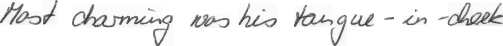
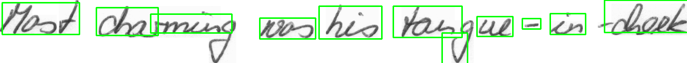

# Handwritten words recognition

This project takes the handwritten words from [IAM Handwriting Database](http://www.fki.inf.unibe.ch/databases/iam-handwriting-database); resizes the images to the same size (by adding padding) and develops a Convolutional Neural Network in Keras to classify the word.

That's okay, but each word has to be fed into the model directly.

## Building a word recognition routine
## Part 1 (EAST)
The next stage is to take handwritten sentences and break these into individual words using the [EAST model](link) before feeding these into the keras model - using `text_detection.py`.  

By running  `python text_detection.py --image ./images/sentence.png`  
The sentence image is loaded, resized to the correct dimensions for the EAST model and then fed into the EAST model to detect the words.

This takes results images such as this:
  
and outputs this:  

It's done okay, but clearly isn't detecting all the words correctly and there are boxes that need to be merged or increased in size to incorportate the depth of the "g" in charming.  These sort of issues would cause the classification model to fail.

## Part 2

